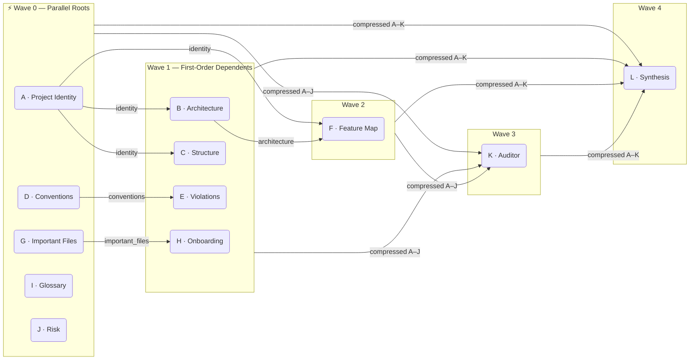

# CodeSpectra — Analysis Agent Pipeline

CodeSpectra analyses a repository by running twelve specialised LLM agents in a dependency-aware DAG. Each agent owns a fixed scope, receives a curated context bundle, and produces a typed JSON output that downstream agents may consume. The pipeline is orchestrated by Haystack `AsyncPipeline`, which resolves inter-agent dependencies and parallelises all agents whose inputs are already satisfied.

---

## Pipeline DAG



> **Per-dependency unblocking.** B starts as soon as A finishes — it does not wait for D, G, I, or J. F starts as soon as both A and B finish. No agent ever blocks on a wave barrier; each unblocks the moment its specific upstream inputs are ready.

---

## Agent Summary

| ID | Full Name | Wave | Token Budget | Direct Upstream |
|----|-----------|:----:|:------------:|-----------------|
| A | Project Identity Agent | 0 | 2,000 | — |
| D | Coding Conventions Agent | 0 | 3,000 | — |
| G | Important Files Radar Agent | 0 | 2,000 | — |
| I | Glossary Agent | 0 | 3,000 | — |
| J | Risk / Complexity Agent | 0 | 3,000 | — |
| B | Architecture Overview Agent | 1 | 2,500 | A |
| C | Repository Structure Agent | 1 | 2,000 | A |
| E | Forbidden Patterns Agent | 1 | 2,000 | D |
| H | Onboarding Reading Order Agent | 1 | 4,000 | G |
| F | Feature Map Agent | 2 | 5,000 | A, B |
| K | Evidence Auditor Agent | 3 | 2,000 | A–J |
| L | Synthesis Agent | 4 | 4,000 | A–K |

---

## Context Sources

Before the pipeline launches, `prefetch_pipeline_context()` runs four retrieval tasks in parallel and stores the results in a `PipelineMemoryContext` object that is passed to the pipeline at construction time. This avoids redundant DB round-trips for data that multiple agents would otherwise fetch independently.

| Field | Content | Agents That Consume It |
|-------|---------|----------------------|
| `arch_bundle` | Top-30 hybrid-retrieved chunks for architecture/framework queries | B, C |
| `folder_tree` | Up to 60 file paths from the manifest, sorted alphabetically | A, C |
| `doc_files` | Full content of README, CHANGELOG, CONTRIBUTING, ARCHITECTURE files (max 4 files) | A |
| `manifest_files` | Content of pyproject.toml, package.json, Cargo.toml, etc. — truncated at 3,000 chars | A |

All other agents run their own targeted retrieval queries at runtime.

---

## Agent Profiles

### A · Project Identity Agent
**Wave 0 · 2,000 tokens**

The foundation agent. Consumes `folder_tree`, `manifest_files`, and `doc_files` from `PipelineMemoryContext` alongside a dedicated retrieval bundle (query: README, package manifests, entrypoints). Infers the project name, primary language, one-sentence purpose, `runtime_type` (e.g. `web_app`, `cli`, `library`), `tech_stack` keywords, and a `business_context` summary.

Output feeds directly into **B**, **C**, and **F**, making Agent A the most upstream dependency in the graph.

---

### B · Architecture Overview Agent
**Wave 1 · 2,500 tokens**

Receives Agent A's identity profile and the pre-fetched `arch_bundle` (architecture/framework/layer retrieval, top-30 chunks). Describes the system's layered structure: major components, data flows, external integrations, database access patterns, and startup entrypoints. Avoids re-documenting project identity — its scope is structural design, not domain purpose.

Output feeds **F** (Feature Map).

---

### C · Repository Structure Agent
**Wave 1 · 2,000 tokens**

Receives Agent A's identity profile plus both `arch_bundle` and `folder_tree` from `PipelineMemoryContext`. Maps top-level directories to their functional roles, identifies layout conventions (e.g. src-layout, feature-based, monorepo), and notes how concerns are physically separated across the file tree. Targeted at developers navigating the codebase for the first time.

No downstream dependents (output is terminal for this scope).

---

### D · Coding Conventions Agent
**Wave 0 · 3,000 tokens**

Runs entirely from its own retrieval strategy (section: `CONVENTIONS`, budget: 10,000 tokens) and the pre-computed `ConventionReport` from `static_convention.py`. Enumerates naming patterns per language, import organisation, documentation style, async usage patterns, and any enforced linting/formatting configuration detected from config files. The static report provides grounded evidence that the LLM cannot fabricate.

Output feeds **E** (Violations).

---

### E · Forbidden Patterns Agent (Violations)
**Wave 1 · 2,000 tokens**

Receives Agent D's full convention description as a negative-space baseline, plus targeted retrieval chunks from source and test files, plus both `static_convention` and `static_risk` reports. Identifies deviations: each violation entry includes the file path, line range, the violated convention, and a brief explanation. Violations are grouped by type for scannable output.

---

### F · Feature Map Agent
**Wave 2 · 5,000 tokens**

The most token-expensive agent in the pipeline. Receives Agent A's identity profile, Agent B's architecture description, and its own retrieval bundle (section: `FEATURE_MAP`, budget: 14,000 tokens). Produces a structured inventory of the project's features and capabilities — each feature annotated with a short description, primary implementing files, and any governing configuration keys. The large budget reflects the need to cover projects with many distinct subsystems without truncating coverage.

---

### G · Important Files Radar Agent
**Wave 0 · 2,000 tokens**

Receives retrieval chunks from the `IMPORTANT_FILES` section (budget: 12,000 tokens) and the structural graph scores (PageRank-style centrality computed over the import graph by the C++ native module). Produces a ranked file list — each entry justified by either high graph centrality (heavily-imported backbone files) or semantic importance (framework entrypoints, configuration roots, bootstrapping scripts).

Output feeds **H** (Onboarding).

---

### H · Onboarding Reading Order Agent
**Wave 1 · 4,000 tokens**

Receives Agent G's ranked file list and supplementary retrieval context. Assembles a practical onboarding guide covering: development environment setup, the conceptual mental model needed to navigate the codebase, a suggested reading order for the important files, and non-obvious design decisions or common pitfalls. Targeted at an engineer joining the project cold.

---

### I · Glossary Agent
**Wave 0 · 3,000 tokens**

Runs from its own retrieval bundle (section: `GLOSSARY`, budget: 7,000 tokens). Extracts domain-specific and project-specific terminology, producing a glossary where each term is paired with a concise definition and a reference to the file or module where it is most prominently defined. Particularly valuable for domain-heavy codebases where business-logic identifiers carry implicit meaning opaque to outside readers.

---

### J · Risk / Complexity Agent
**Wave 0 · 3,000 tokens**

Synthesises the pre-computed `RiskReport` from `static_risk.py` — which includes keyword-annotation hits, circular-import clusters (Tarjan SCC), god-object candidates, and test coverage ratio — into a structured risk assessment. Groups findings by severity (high / medium / low), counts instances per category, and surfaces representative code examples for each risk type. Runs in Wave 0 because it depends entirely on pre-computed static data, not on any other agent's LLM output.

---

### K · Evidence Auditor Agent
**Wave 3 · 2,000 tokens**

A meta-agent. Receives compressed previews of all ten preceding agents' outputs, produced by `_SectionCompressor.compress_section()` with a `char_cap` of 500 characters per section. Performs cross-section consistency checks: flags contradictions (e.g. an architecture description that conflicts with the feature map), coverage gaps (e.g. a major directory unmentioned by any agent), and assigns a confidence score to each section. Does not perform any repository retrieval — its entire reasoning is over agent outputs, not source code.

Output feeds **L** (Synthesis).

---

### L · Synthesis Agent
**Wave 4 · 4,000 tokens**

The terminal agent. Receives compressed previews of all preceding agents' outputs (A–K) at `char_cap` 800 characters per section, plus Agent K's full audit report. Its purpose is to weave the structured outputs of all upstream agents into a coherent prose narrative suitable for a technical document or wiki. Rather than concatenating section summaries, it resolves contradictions flagged by the Auditor, emphasises the most architecturally significant findings, and ensures the narrative reads as a unified document. The 4,000-token budget reflects the breadth of content it must integrate.

---

## Output Contract

Each analysis run produces a versioned report stored in `analysis_reports.report_json`:

```json
{
  "version": 3,
  "sections": {
    "A": { "repo_name": "...", "domain": "...", "..." : "..." },
    "B": { "main_layers": [], "..." : "..." },
    "K": { "..." : "..." },
    "L": { "..." : "..." }
  },
  "section_hashes": {
    "A": "<sha256>",
    "...": "..."
  },
  "static_cache": {
    "risk_report": {},
    "convention_report": {},
    "graph_summary": {}
  }
}
```

`section_hashes` lets the diff engine short-circuit field-level comparison for unchanged sections. `static_cache` embeds the pre-LLM static analysis outputs to guarantee UI consistency even after re-indexing. The diff engine accepts both version 2 and version 3 reports.
